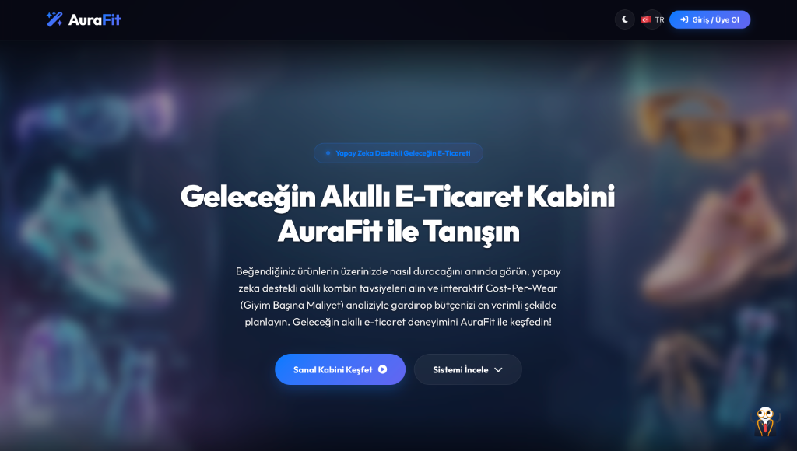
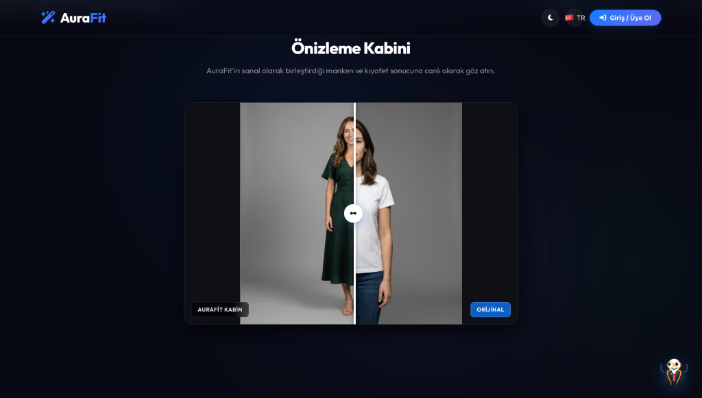

# 🌟 AuraFIT: Geleceğin Yapay Zeka Destekli Akıllı E-Ticaret Kabini

🌐 Canlı Site Linki: https://aura-fit-gold.vercel.app/

AuraFIT, kullanıcıların e-ticaret sitelerinde beğendikleri kıyafetleri kendi üzerlerinde sanal olarak deneyebildikleri, **Google Gemini 3 Flash** modeliyle akıllı finansal (Cost-per-Wear) ve stilist danışmanlık hizmeti sunan devrim niteliğinde bir platformdur. Apple şıklığında tasarlanmış büyüleyici arayüzü sayesinde kusursuz bir kullanıcı deneyimi sunar.
---

## ✨ Öne Çıkan Süper Özellikler

AuraFIT, standart bir sanal kabin olmanın çok ötesine geçerek e-ticaret dünyasını yeni bir boyuta taşıyor:

### 🔗 E-Ticaret Linki İle Otomatik Çözümleme
Manuel fotoğraf yükleme zahmetine son! Trendyol, Zara veya H&M gibi sitelerdeki ürün linklerini kopyalayıp AuraFIT'e yapıştırmanız yeterlidir. Sistem ürünün görselini, başlığını, detaylarını ve güncel fiyatını **otomatik olarak saniyeler içinde parse eder**.

### 💬 Gerçek Alıcı Yorumları & Sentiment Analizi
Ürün linkinden çekilen gerçek müşteri yorumları, arka planda çalışan **Gemini Yapay Zekası** tarafından duygu analizine (Sentiment Analysis) tabi tutulur. Böylece müşterilerin ürünün kalıbı, kumaşı ve kalitesi hakkındaki genel düşünceleri size **tek cümlelik şık bir özet ve puanlamalarla** sunulur.

### 🤖 Gemini 3 Flash Destekli Terzi & Stil Asistanı
Platforma entegre olan AuraFIT Terzi Asistanı, Google'ın piyasadaki en son ve en hızlı aktif modeli olan **`gemini-3-flash-preview`** ile çalışır. Kombin önerileri, renk kontrastları, vücut tipinize uygunluk ve Cost-per-Wear (giyim başı maliyet) gibi konularda gerçek zamanlı akıllı sohbetler edebilirsiniz.

### 👗 Kusursuz Sanal Kabin Deneyimi (IDM-VTON)
Bulut GPU sunucularımızda paralel olarak çalışan görsel motoru, seçtiğiniz veya linkten kopyaladığınız kıyafeti mankenin (veya kendi yüklediğiniz fotoğrafınızın) üzerine kumaş dokularını ve gölgelendirmelerini koruyarak **kusursuzca giydirir.**

---

## 📸 Arayüz & Kullanıcı Deneyimi (Apple Şıklığı)

Sistem, en modern UI/UX prensipleriyle (Glassmorphism, Neon Blur, pürüzsüz animasyonlar) geliştirilmiştir:
- **Karanlık Tema (Dark Mode):** Şık, göz yormayan, premium renk geçişleri.
- **Akıllı Formlar:** E-Ticaret linki ile "Otomatik Doldur (YENİ)" ve "Klasik Manuel Yükleme" alanları estetik etiketlerle birbirinden ayrılmıştır.
- **Canlı Önizleme:** Giydirme sonrası sonuçları "Öncesi / Sonrası" slider'ı üzerinden gerçek zamanlı inceleyebilirsiniz.

---

## 🛠️ Teknoloji Yığını

* **Frontend:** Vanilla HTML5, CSS3 (Gelişmiş CSS Değişkenleri, Glassmorphism, Responsive Tasarım), Vanilla ES6 JavaScript.
* **Backend:** FastAPI (Python), Async Paralel İstek İşleyiciler.
* **Yapay Zeka (Cognitive):** **Google Gemini 3 Flash Preview** (Metin oluşturma, veri çıkarımı, yorum analizi, ROI ölçümlemesi).
* **Yapay Zeka (Vision):** IDM-VTON (Hugging Face API Üzerinden Sanal Kıyafet Giydirme Ağları).
* **Veritabanı:** Neon Serverless PostgreSQL (SQLAlchemy).
* **Auth:** Güvenli Stateless JWT ve bcrypt şifreleme.

---
Geliştiren: Ümitcan ÇİNAR 
---
*Tüm hakları saklıdır. Geleceğin akıllı alışveriş teknolojisi.*
